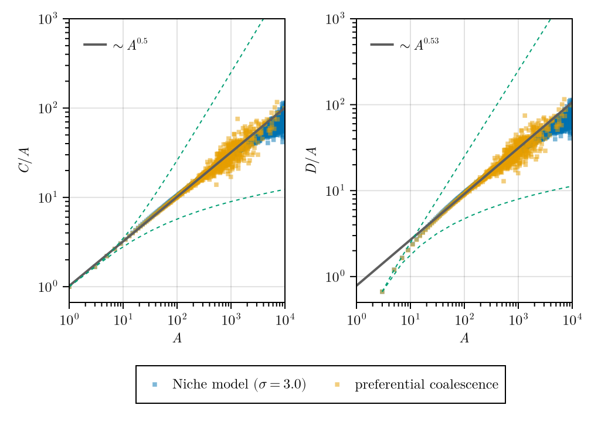

# PhyloTrees

Data generation and visualization based on [`TreeProcesses.jl`](https://github.com/skleinbo/TreeProcesses.jl/.)

## Usage

Installation

1. Clone this repository.
2. Start Julia in the repo folder `julia --project`
3. The required packages are not registered in the Julia general registry, but in my private one. Subscribe to it first

    ```
    pkg> registry add https://github.com/skleinbo/JuliaRegistry.jl.git
    ```

4. Then install all necessary packages

   ```
   pkg> instantiate
    ```

5. Or copy-paste

  ```
  import Pkg
  import Pkg: RegistrySpec
  Pkg.Registry.add(RegistrySpec(url="https://github.com/skleinbo/JuliaRegistry.jl.git"))
  Pkg.add(["BinaryTrees","TreeProcesses"])
  Pkg.instantiate()
  ```

You may alternatively install directly from the repos

```
import Pkg
import Pkg: PackageSpec
Pkg.activate(".")
Pkg.add([
  PackageSpec(url="https://github.com/skleinbo/BinaryTrees.jl/"),
  PackageSpec(url="https://github.com/skleinbo/TreeProcesses.jl/"),
  PackageSpec(url="https://github.com/skleinbo/WeightedSampling.jl/")
])
Pkg.instantiate()
```

Note that this will always install the newest versions of `BinaryTrees`, `WeightedSampling` and `TreeProcesses`, and may result in incompatibilities.

## Example

Include `run.jl` to sample data and `plot.jl` to generate this plot from them


